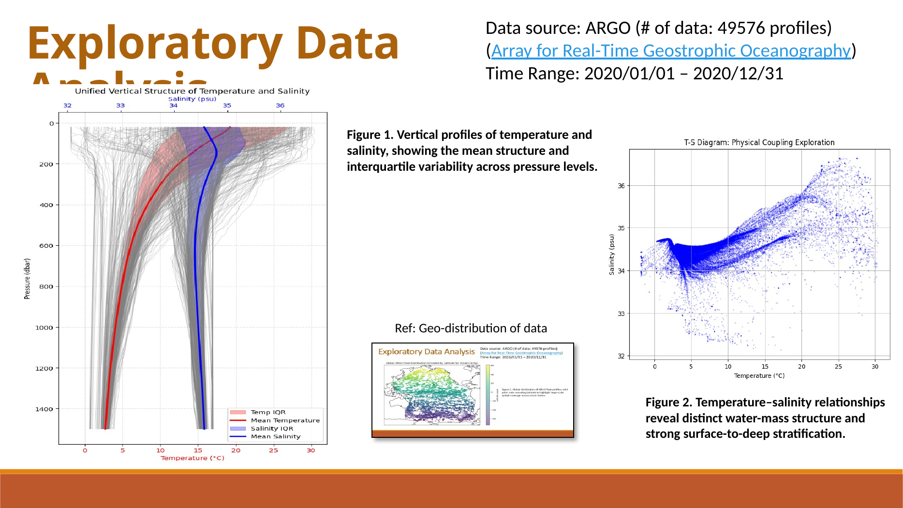
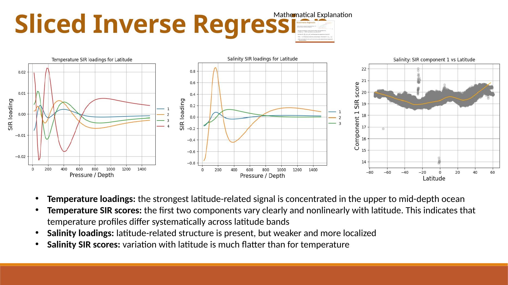
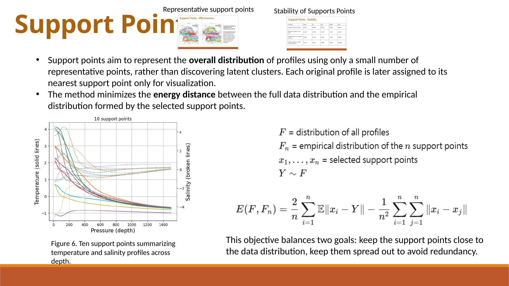
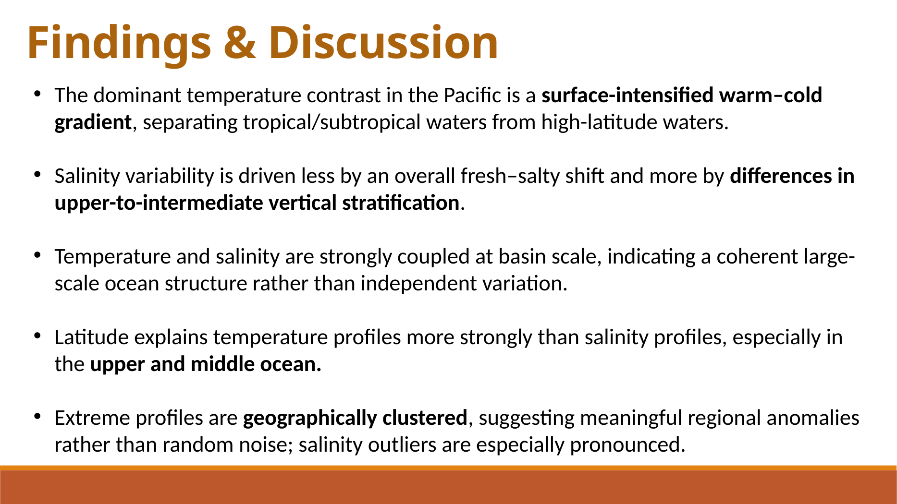
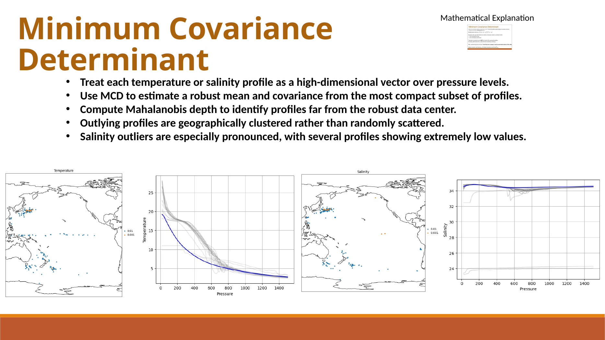

# Ocean Profile Analysis

This repository analyzes **ARGO ocean temperature and salinity profiles** using multivariate statistical methods. The project focuses on how vertical ocean structure varies across the Pacific in 2020 and how dimension reduction, robust covariance estimation, depth-based outlier detection, and quantization can reveal meaningful large-scale ocean patterns.

The original course submission was prepared as a **slide-based report**, so this repo packages the slides together with the supporting notebooks and scripts, while also surfacing the main figures and findings directly in the README.

## Why this project matters

ARGO profiles are high-dimensional functional observations. Each float profile contains temperature and salinity measured over depth, along with geographic and temporal context. These data are too rich to summarize well with simple univariate plots alone.

This project shows how to analyze them with a **multivariate workflow** that combines:
- dimension reduction
- cross-profile dependence analysis
- supervised sufficient dimension reduction
- robust outlier detection
- representative-point compression

## Data summary

The analysis uses **49,576 ARGO profiles** from the **Pacific Ocean in 2020**.

| Item | Description |
|---|---|
| Source | ARGO (Array for Real-Time Geostrophic Oceanography) |
| Region | Pacific Ocean |
| Time range | 2020-01-01 to 2020-12-31 |
| Response structure | 100-dimensional vertical profiles |
| Main variables | Temperature, salinity, pressure, latitude, longitude, day |
| Core challenge | High-dimensional, irregularly observed profile data |

## Methods overview

| Method | Purpose | Main role in project |
|---|---|---|
| PCA | Unsupervised dimension reduction | Summarize dominant vertical variation in temperature and salinity |
| CCA | Cross-dataset dependence analysis | Quantify coupled temperature-salinity modes |
| SIR | Supervised dimension reduction | Identify depth regions most informative for latitude |
| MCD + Mahalanobis distance | Robust covariance and anomaly detection | Detect non-typical profiles without being dominated by outliers |
| Support points | Distributional compression / quantization | Represent the full dataset using a small set of profiles |
| Data depth | Centrality / outlyingness ranking | Organize profiles by how typical or unusual they are |

## Selected findings

| Topic | Main finding |
|---|---|
| Temperature PCA | PC1 mainly captures the overall upper-ocean temperature level |
| Salinity PCA | PC3 reflects basin-scale regional salinity contrasts |
| Temperature-salinity coupling | The leading canonical mode is strong, with canonical correlation around **0.888** |
| SIR | Latitude-related structure is strongest in the upper to mid-depth temperature profile |
| Robust outlier analysis | Outlying profiles are geographically clustered, not randomly scattered |
| Support points | A small representative set preserves dominant regional profile structure |

## Selected figures

### Exploratory structure of the profiles

This slide summarizes the vertical profile behavior and temperature-salinity relationship that motivate the rest of the multivariate analysis.



### PCA reveals interpretable dominant modes

The slide below highlights how principal components summarize physically meaningful variation, including overall temperature level and regional salinity structure.



### CCA captures coupled temperature-salinity structure

A strong leading canonical mode shows that temperature and salinity co-vary in a systematic large-scale way.



### SIR identifies depth regions most informative for latitude

Supervised dimension reduction shows that latitude signal is much more prominent in temperature than in salinity, especially in upper to mid-depth water.



### Robust covariance and outlier analysis

The MCD-based analysis shows that unusual profiles are spatially structured rather than random noise.


### Support points compress the dataset while preserving broad structure

Support points provide a compact summary of the full profile distribution and still retain large-scale geographic variation.



## Main takeaways

- Ocean profile data are naturally **functional and multivariate**, so multivariate methods add real value beyond simple summaries
- A small number of latent components captures much of the vertical profile variation
- Temperature and salinity are strongly coupled, but not redundantly so
- Geographic structure, especially latitude, is reflected more strongly in temperature than salinity
- Robust methods are important because unusual profiles are present and spatially patterned
- Representative-point methods can compress a large profile dataset without discarding its dominant structure

## Repository structure

```text
ocean_profile_analysis_repo_package/
├── analysis/
│   ├── depth.ipynb
│   ├── depth.Rmd
│   ├── dimred.ipynb
│   ├── dimred.Rmd
│   ├── mincovdet.ipynb
│   ├── support.ipynb
│   └── support.Rmd
├── docs/
│   ├── report_slides.pptx
│   └── support_notes.pdf
├── figures/
│   ├── page_2.png
│   ├── page_5.png
│   ├── page_6.png
│   ├── page_7.png
│   ├── page_8.png
│   └── page_9.png
├── scripts/
│   ├── depth.jl
│   ├── get_data.jl
│   ├── get_data.py
│   ├── get_data.R
│   ├── mfsir.jl
│   ├── pca.jl
│   ├── prep.jl
│   ├── prep.py
│   ├── read.jl
│   ├── read.py
│   ├── read.R
│   └── support.jl
├── data/
│   └── README.md
├── raw/
│   └── README.md
└── .gitignore
```

## Reproducibility

### 1. Download raw ARGO data

Use one of the `get_data` scripts to download the raw files:

```bash
python scripts/get_data.py
```

### 2. Preprocess onto a common pressure grid

Run one of the preprocessing scripts:

```bash
python scripts/prep.py
```

This produces the processed matrices expected by the analysis notebooks.

### 3. Run the analyses

- `analysis/dimred.ipynb` for PCA and related dimension reduction
- `analysis/depth.ipynb` for data depth and outlyingness
- `analysis/mincovdet.ipynb` for robust covariance analysis
- `analysis/support.ipynb` for support-point quantization

## Notes

- The original submission was a **slide deck**, so this repository is intentionally organized to make the code and results easier to browse on GitHub.
- The processed matrices are not bundled here because they can be regenerated from raw ARGO downloads.
- The slide screenshots in `figures/` are included so the repository remains visually informative even without opening the presentation.

## Possible next improvements

- export individual plots from notebooks instead of relying mainly on slide screenshots
- add explained-variance and loading tables directly from the PCA pipeline
- include a lightweight sample of processed profile data for faster reproduction
- build an interactive map for profile and outlier exploration

## Author

**Hao-Chun Shih**
