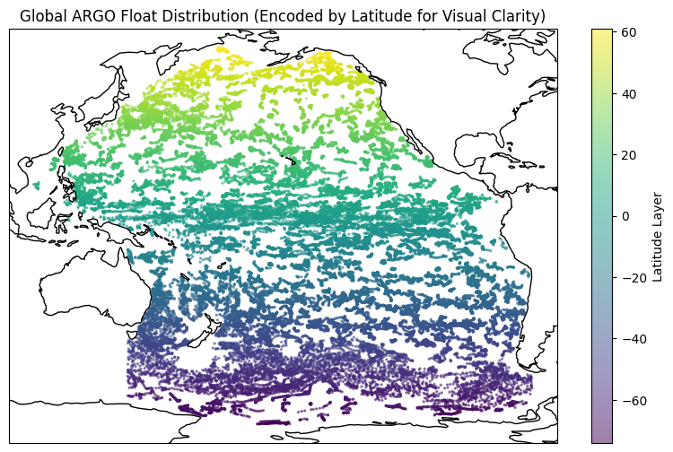
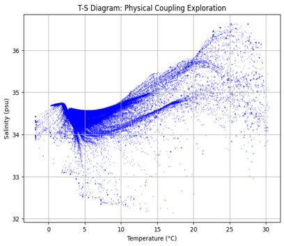
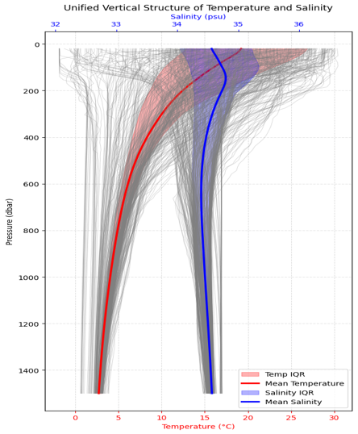
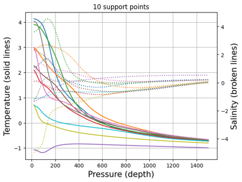
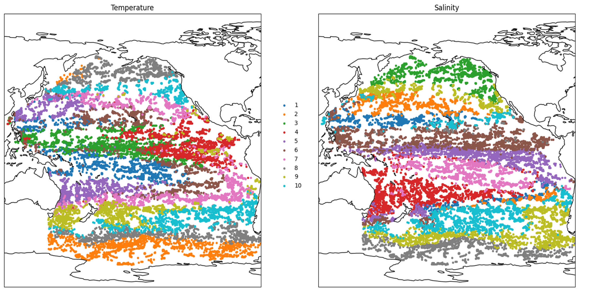
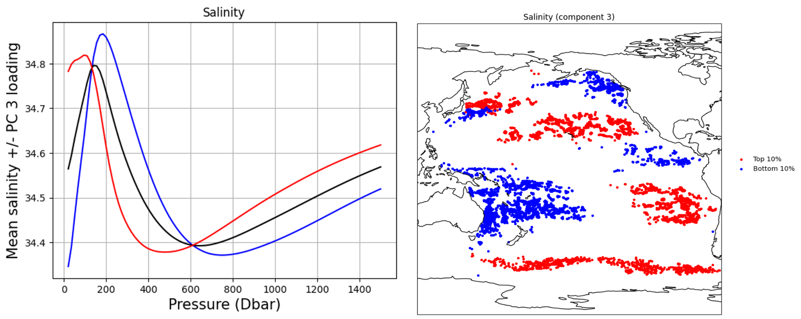
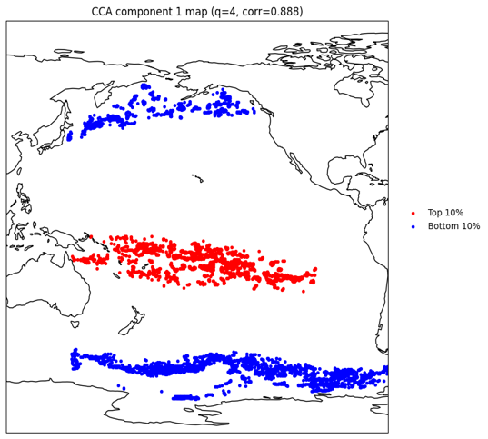
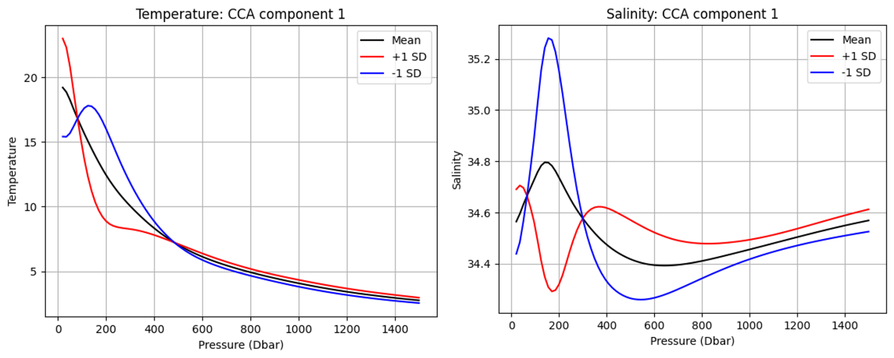
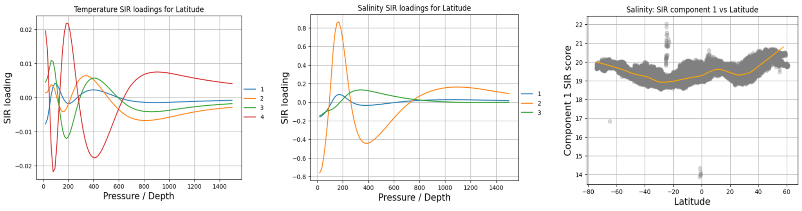
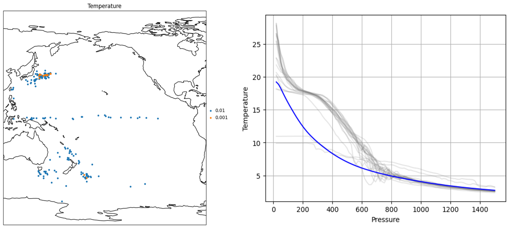

# Multivariate Analysis of Ocean Temperature and Salinity Data Using ARGO

This repository analyzes **ARGO ocean temperature and salinity data** using multivariate statistical methods. The project studies how vertical ocean structure varies across the Pacific in 2020 and shows how dimension reduction, robust covariance estimation, depth-based outlier detection, and representative-point compression can reveal meaningful large-scale ocean patterns.

The original course submission was prepared as a **slide-based report**, but this repository reorganizes the project into a cleaner GitHub format with the main code, supporting materials, and selected figures surfaced directly in the README.

## Why this project matters

ARGO measurements are naturally **high-dimensional functional observations**. Each float profile contains temperature and salinity observed across pressure levels, together with geographic and temporal context. These data are too rich to summarize well with simple univariate plots alone.

This project demonstrates a multivariate workflow that combines:
- dimension reduction
- cross-profile dependence analysis
- supervised sufficient dimension reduction
- robust outlier detection
- representative-point compression

## Data summary

The analysis uses **49,576 ARGO profiles** from the **Pacific Ocean in 2020**.

| Item | Description |
|---|---|
| Source | ARGO (Array for Real-Time Geostrophic Oceanography) |
| Region | Pacific Ocean |
| Time range | 2020-01-01 to 2020-12-31 |
| Response structure | 100-dimensional vertical profiles |
| Main variables | Temperature, salinity, pressure, latitude, longitude, day |
| Core challenge | High-dimensional, irregularly observed profile data |

## Methods overview

| Method | Purpose | Main role in project |
|---|---|---|
| PCA | Unsupervised dimension reduction | Summarize dominant vertical variation in temperature and salinity |
| CCA | Cross-dataset dependence analysis | Quantify coupled temperature-salinity modes |
| SIR | Supervised dimension reduction | Identify depth regions most informative for latitude |
| MCD + Mahalanobis distance | Robust covariance and anomaly detection | Detect non-typical profiles without being dominated by outliers |
| Support points | Distributional compression / quantization | Represent the full dataset using a small set of profiles |
| Data depth | Centrality / outlyingness ranking | Organize profiles by how typical or unusual they are |

## Selected findings

| Topic | Main finding |
|---|---|
| Global coverage | ARGO floats provide broad spatial coverage across the Pacific, with strong latitudinal structure |
| Mean vertical structure | Temperature decreases sharply with depth, while salinity shows a more nonlinear vertical pattern |
| Temperature PCA | Leading components capture interpretable upper-ocean and basin-scale variation |
| Salinity PCA | PC3 reflects basin-scale regional salinity contrasts |
| Temperature-salinity coupling | The leading canonical mode is strong, with canonical correlation around **0.888** |
| SIR | Latitude-related structure is stronger in temperature than in salinity, especially in upper to mid-depth regions |
| Robust outlier analysis | Outlying profiles are geographically clustered rather than randomly scattered |
| Support points | A small representative set preserves dominant regional profile structure |

## Selected figures

### 1. ARGO float distribution across the Pacific

This map shows the broad geographic coverage of the ARGO observations used in the analysis.



### 2. Physical coupling in temperature-salinity space

The T-S diagram gives a compact physical view of how temperature and salinity co-vary across the full sample.



### 3. Unified vertical structure of temperature and salinity

The mean temperature and salinity curves, along with their interquartile bands, summarize the typical vertical structure of the Pacific profiles.



### 4. Support-point profile summaries

These representative curves show how a small set of support points can approximate the broader temperature and salinity distribution.



### 5. Support-point geographic representation

The support points are not only representative in profile space, but also reflect broad geographic structure in the Pacific basin.



### 6. PCA regional structure in temperature and salinity

Principal-component based grouping reveals large-scale spatial organization in both temperature and salinity fields.


### 7. Salinity PC3 and its geographic expression

Salinity PC3 captures a distinct mode of vertical salinity variation and separates geographically meaningful regions across the basin.



### 8. Canonical correlation analysis (CCA)

CCA identifies coupled temperature-salinity modes. The figure below shows the leading canonical spatial pattern and the corresponding temperature and salinity profile shapes.





### 9. SIR for latitude-related structure

SIR highlights which depth regions are most informative for latitude and shows that temperature contains stronger supervised structure than salinity.



### 10. Robust outlier analysis with MCD

The MCD-based analysis identifies geographically clustered outlying profiles and compares them against a representative central temperature curve.



## Main takeaways

- Ocean temperature and salinity data are naturally **functional and multivariate**, so multivariate methods add real value beyond simple summaries.
- A small number of latent components captures much of the large-scale vertical structure.
- Temperature and salinity are strongly coupled, but the coupling is not redundant and contains interpretable basin-scale patterns.
- Geographic structure, especially latitude, is reflected more strongly in temperature than salinity in the supervised analysis.
- Robust methods matter because unusual profiles are present and spatially patterned.
- Representative-point methods can compress a large profile dataset while preserving its dominant structure.

## Repository structure

```text
ocean_profile_analysis_repo_package/
├── analysis/
│   ├── depth.ipynb
│   ├── depth.Rmd
│   ├── dimred.ipynb
│   ├── dimred.Rmd
│   ├── mincovdet.ipynb
│   ├── support.ipynb
│   └── support.Rmd
├── docs/
│   ├── report_slides.pptx
│   └── support_notes.pdf
├── figures/
│   ├── argo_float_distribution.png
│   ├── ts_diagram.png
│   ├── unified_vertical_structure.png
│   ├── support_points_profiles.png
│   ├── support_points_map.png
│   ├── pca_regional_structure.png
│   ├── pca_salinity_pc3.png
│   ├── cca_component_map.png
│   ├── cca_profile_shapes.png
│   ├── sir_latitude_analysis.png
│   └── mcd_outlier_profiles.png
├── scripts/
│   ├── depth.jl
│   ├── get_data.jl
│   ├── get_data.py
│   ├── get_data.R
│   ├── mfsir.jl
│   ├── pca.jl
│   ├── prep.jl
│   ├── prep.py
│   ├── read.jl
│   ├── read.py
│   ├── read.R
│   └── support.jl
├── data/
│   └── README.md
├── raw/
│   └── README.md
└── .gitignore
```

## Reproducibility

### 1. Download raw ARGO data

Use one of the `get_data` scripts to download the raw files:

```bash
python scripts/get_data.py
```

### 2. Preprocess onto a common pressure grid

Run one of the preprocessing scripts:

```bash
python scripts/prep.py
```

This produces the processed matrices expected by the analysis notebooks.

### 3. Run the analyses

- `analysis/dimred.ipynb` for PCA and related dimension reduction
- `analysis/depth.ipynb` for data depth and outlyingness
- `analysis/mincovdet.ipynb` for robust covariance analysis
- `analysis/support.ipynb` for support-point quantization

## Notes

- The original submission was a **slide deck**, but this repository highlights exported analysis figures directly in the README so the results are easier to browse on GitHub.
- The processed matrices are not bundled here because they can be regenerated from raw ARGO downloads.
- The presentation is still included in `docs/` for reference.

## Possible next improvements

- add explained-variance and loading tables directly from the PCA pipeline
- include a lightweight sample of processed profile data for faster reproduction
- build an interactive map for profile and outlier exploration
- add a small environment file for easier setup across Julia, Python, and R workflows

## Author

**Hao-Chun Shih**
